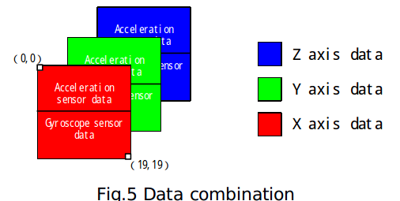
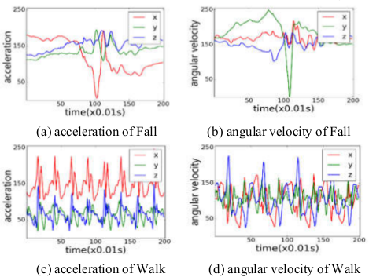
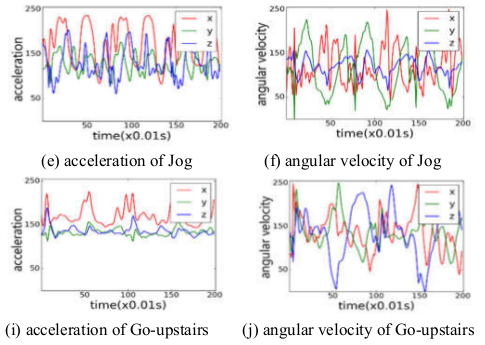
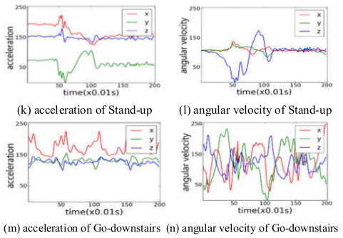
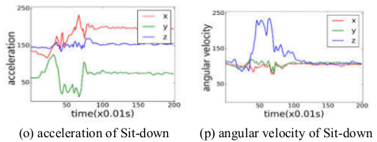
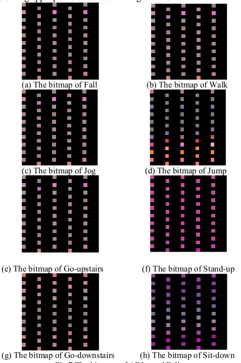
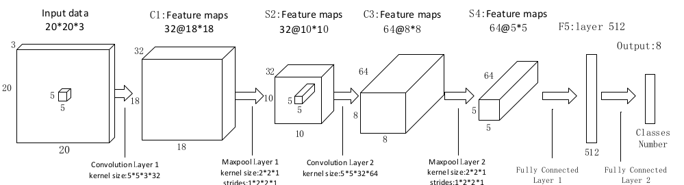

# AFD-CNN(ADL and Fall Detection Convolutional Neural Networks)
our paper[https://ieeexplore.ieee.org/document/8662651]
## Sensor data to img
if the 3-axes of the human motion model are considered as the 3 channels of a RGB image, the value of the XYZ axial data can be mapped into the value of the RGB channel data in a RGB image respectively. Namely, each 3-axial data can be converted into an RGB pixel. The 400 pieces of 3-axial data cached in the sliding window can be viewed as a bitmap with size of 20 or 20 pixels.

you can use .utils.transform.data2image func to make sensor data to img

ADLs and fall data graph

sensor data to img

## Net construct

we use imgs to train our network

## Net performance
- accuracy = 0.978718

| Class        | Sensitivity    |Specificity  |
| ----- | -----:   | :----: |
| Fall        | 1.000000      |   0.998654    |
| Walk        | 0.969072      |   1.000000    |
| Jog        | 0.983051      |   0.993243    |
| Jump        | 0.948980      |   0.998684    |
| up stair | 0.989474      |   0.997379    |
| down stair|0.967213|0.991848|
| stand to sit|  0.981481      |   0.998667    |
| sit to stand | 0.990476      |   0.997344    |
| Average        | 0.978718      |   0.996977    |

## Requirenments
- python3
- tensorflow 1.4.0
- pandas
- numpy
- matplotlib

## How to train and test
    python ./src/cnn.py

## Dataset
we need two public datasets.

- 1.MobiFall＆MobiAct DataSet
http://www.bmi.teicrete.gr/index.php/research/mobiact

- 2.SisFall http://sistemic.udea.edu.co/en/investigacion/proyectos/english-falls/

